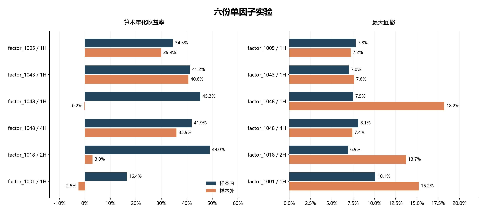
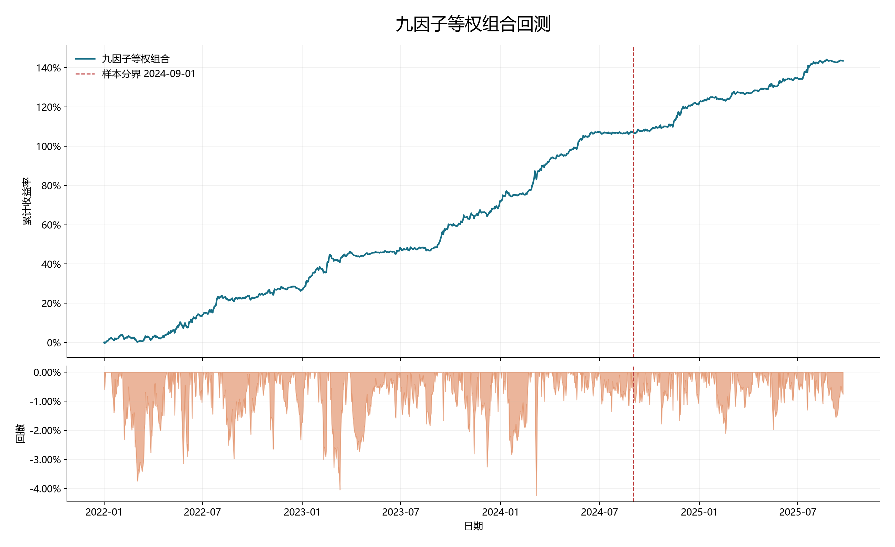

# 区块链量化回测交易系统

[English](README.md) | [简体中文](README.zh-CN.md)

这是我个人在区块链加密资产量化交易上的一次实践，涵盖因子挖掘、组合回测和实盘交易等。

策略采用截面多空的方式：比较同一时点不同币种的因子值，按排名建立多头和空头仓位，再合成多因子组合。在研究的过程中使用了遗传算法和贝叶斯寻优来搜索参数，同时用遗传编程探索因子表达式；进入实盘后，通过 OKX API 更新行情、读取持仓并执行订单。

整体的实验、系统设计以及实盘记录我都整理在这里，但是因子公式和核心代码等由于个人隐私原因暂不公开。

[因子实验](docs/research-cases.md) · [组合回测](docs/portfolio.md) · [交易系统](docs/execution.md) · [实盘记录](docs/live-trading.md) · [实验目录](docs/experiment-inventory.md)

## 系统怎么运行

研究和交易分开运行。研究端负责计算因子、搜索参数和回测；交易端读取选定的策略配置，更新行情，算出目标仓位，再与账户中的实际持仓比较，按差额下单。

主要使用 Python、pandas、NumPy、SciPy、Numba 和 Matplotlib。遗传编程使用 DEAP，交易接口使用 CCXT。

[代码模块与数据流程](docs/architecture.md)

## 单个因子的表现

我主要通过样本内外的对比来观察因子表现。下面六份实验既包括样本外仍有收益的因子，也包括收益明显衰减或转为亏损的情况。

其中，`factor_1043` 的一小时版本在两个区间都有正收益，`factor_1018` 的两小时版本则在样本外明显变弱。这些结果让我更关注因子离开训练区间后的表现。

六份案例是从已有的 53 份单因子报告中选出的，每份报告保留六组候选参数。上图取各报告的第 1 组，具体参数和其他候选结果放在[实验页面](docs/research-cases.md)，完整目录见[实验汇总](docs/experiment-inventory.md)。

## 九因子组合回测

组合采用九个因子，每个因子的权重都是 1/9。参数在样本内训练，2024 年 9 月 1 日起的数据用于样本外评估。

| 区间 | 开始 | 结束 | 累计收益 | 算术年化 | 夏普 | 最大回撤 |
|---|---|---|---:|---:|---:|---:|
| 样本内 | 2022-01-01 | 2024-08-31 | 107.08% | 40.1% | 3.739 | 4.2% |
| 样本外 | 2024-09-01 | 2025-09-22 | 36.37% | 34.3% | 3.795 | 2.1% |
| 总体 | 2022-01-01 | 2025-09-22 | 143.45% | 38.5% | 3.743 | 4.2% |

初始本金为 100,000。收益按固定本金逐日累加，不按复利计算；回撤也按固定本金计算。分界日前后沿用同一套持仓，表中分别统计两段时间的表现。

费用先在各因子内部计算，再合成组合收益。详细配置和计算方式放在[组合回测](docs/portfolio.md)与[研究方法](docs/methodology.md)中。

## 实盘运行

我用 2,000 USDT 运行了这套截面多空策略。下面是 2025 年 8 月 11 日至 11 月 9 日的账户截图，累计盈利为 282.89 USDT。

当时参考的回测最大回撤约为 5%，我将实盘回撤上限设为 6%。11 月 9 日，回撤超过上限，虽然账户累计收益仍为正，我还是按原定规则停止了策略运行。

那时我正在准备考研，没有再重新启动策略，之后也未继续运行。这段实盘记录因此截至 2025 年 11 月 9 日。

[实盘记录与停止原因](docs/live-trading.md)

## 后续研究方向

这次实盘让我注意到交易成本的差异。回测费率设为万分之 2.5，实际平均成交费率约为万分之 3.8；账户的挂单费率为万分之 2，吃单费率为万分之 5。

后续我希望结合订单簿研究下单方式，比较挂单价格、等待时间和撤单重挂频率对成交的影响。降低手续费的同时，也需要考虑滑点、成交率以及调仓是否及时。

[下单流程与交易成本](docs/execution.md)

## 文件说明

`docs/` 是方法和系统说明，`assets/` 是图表，`reports/` 是参数及绩效记录。行情原始数据、账户信息和策略源码保留在本地。
