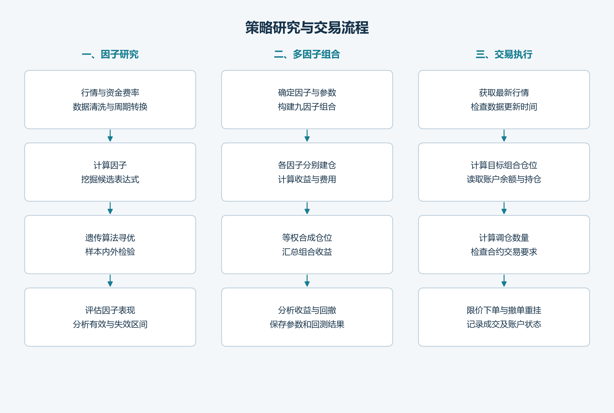

# System Structure

[English](architecture.en.md) | [简体中文](architecture.md)

[Project home](../README.md)

I split the system into research, portfolio construction, and trading. These handle factor and parameter experiments, portfolio backtesting, and live order execution, respectively. I select the research candidates that enter the trading configuration.

## Research and backtesting

Market data and funding rates are aligned by timestamp before factors are calculated at different frequencies. A genetic algorithm searches for parameters, while genetic programming explores factor expressions. Each parameter experiment saves return curves and performance metrics for comparison.

In portfolio backtests, each factor generates its own positions and returns before they are combined by weight. The nine-factor configuration and results are in the [portfolio backtest](portfolio.en.md).

## From target positions to orders

At each trading interval, the program reads the strategy configuration, updates market data, and calculates portfolio positions. It then reads the account balance and actual holdings, calculates the required trades, submits orders, and records the results.

Research uses historical data; the trading system periodically updates data through the API. Before a factor is added to the trading configuration, its input fields and data frequency need to be checked.

## Main files

| File | Purpose |
|---|---|
| `factor_portfolio_optimization.py` | Run portfolio backtests |
| `factor_portfolio_methods.py` | Calculate portfolio weights |
| `okx_history_data.py` | Update market data and funding rates |
| `trading_system.py` | Schedule strategies, query the account, and handle orders |
| `order_recorder.py` | Save execution records |

[Trading workflow](execution.en.md)
