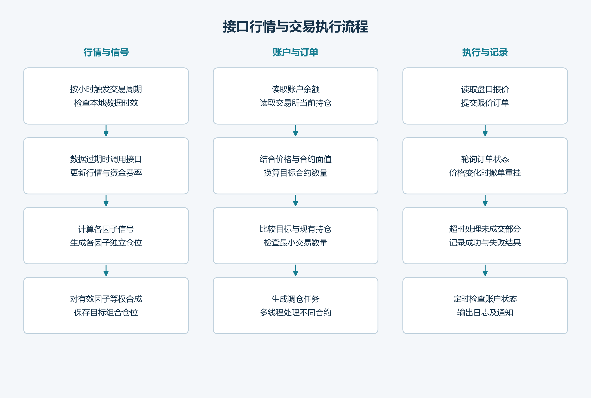

# Market Data and Trade Execution

[English](execution.en.md) | [简体中文](execution.md)

[Project home](../README.md)

The trading program calculates target positions from current market data, compares them with actual holdings, and generates orders for the difference.

## Market data updates

Perpetual futures candles and funding rates are fetched through the OKX API and stored locally. Updates for different contracts can run in parallel, and failed requests are retried.

The strategy runs once an hour. It checks whether data are up to date before calculating factors. If the update step reports a failure, that trading cycle is skipped.

## Target positions and account reconciliation

Each factor generates positions independently, and these are combined with equal weights. The program reads the account balance and existing holdings, then converts target positions into contract quantities using prices, leverage, and contract face values.

The target quantity minus existing holdings gives the required adjustment. Prices, contract specifications, and minimum order sizes are checked before orders are placed.

## Order handling

| Step | Implementation |
|---|---|
| Get quotes | Read the order book and choose a limit price for the trade direction |
| Submit orders | Place limit orders with the specified position side |
| Check status | Poll execution progress |
| Update quotes | Cancel and resubmit when prices change |
| Handle timeouts | End the wait and handle unfilled quantities |
| Record execution | Save order outcomes and execution times |
| Monitor the account | Check balances and positions periodically and send notifications |

Rebalancing tasks for different contracts run in a thread pool. The strategy is triggered at the start of each hour; account monitoring runs at minutes 5 and 35. The limit-order tracking loop has a 210-second limit and polls approximately every 1.5 seconds. Network requests and retries can extend the total elapsed time.

## Transaction costs and execution research

I used a fee of 2.5 basis points in the backtest, compared with an average of approximately 3.8 basis points in live trading. In further research, I want to connect this cost difference to the way orders are placed.

| Cost item | Fee rate |
|---|---:|
| Backtest trading fee | 0.025% (2.5 basis points) |
| Live taker fee | 0.050% (5 basis points) |
| Live maker fee | 0.020% (2 basis points) |
| Average live execution fee | Approximately 0.038% (3.8 basis points) |

The live fees apply to my account during the period described above; the published backtest results still use 2.5 basis points.

I will consider order price, waiting time, and how often orders are cancelled and resubmitted. Maker fees are lower, but waiting too long or failing to fill an order can delay rebalancing. Fees, slippage, fill rates, and execution time therefore need to be compared together.

Order books and limit-order placement strategies are the next areas I would like to study in more depth.

Account returns and the reason for stopping are documented in the [live trading record](live-trading.en.md).
