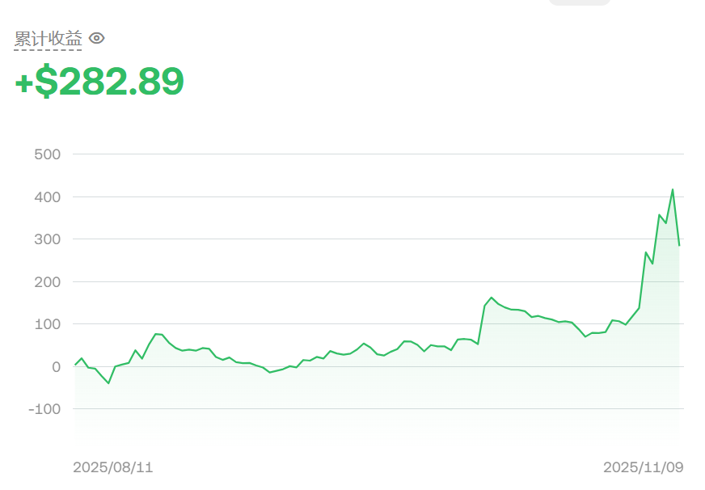

# 实盘记录

[English](live-trading.en.md) | [简体中文](live-trading.md)

[项目首页](../README.zh-CN.md)

下面是 2025 年 8 月 11 日至 11 月 9 日的账户累计收益截图，初始资金为2000U，每次下单都用2000U作为总资金，满足回测过程中的单利计算。

| 项目 | 记录 |
|---|---|
| 初始资金 | 2,000 USDT |
| 截图区间 | 2025-08-11 至 2025-11-09 |
| 累计收益 | +282.89 USDT |
| 回撤上限 | 6% |
| 停止日期 | 2025-11-09 |

## 停止运行及后续

当时参考回测的最大回撤约为 5%，所以我就将实盘回撤上限设为 6%。11 月 9 日的时候收益从高点回落，回撤超过6%，大概是6.7%，因此尽管账户累计收益仍为正，我还是按照原定的规则停止了策略运行。恰好彼时我正在准备考研，所以之后也没有再重新启动策略。

## 实盘与回测的差别

一开始回测的时候费率设为万分之 2.5，但是最终实盘平均成交费率约为万分之 3.8。这个差异是我希望继续研究订单执行的原因——怎样选择最合适的挂单策略，才能在减少费用的同时完成调仓。

[订单执行与费率说明](execution.md)
