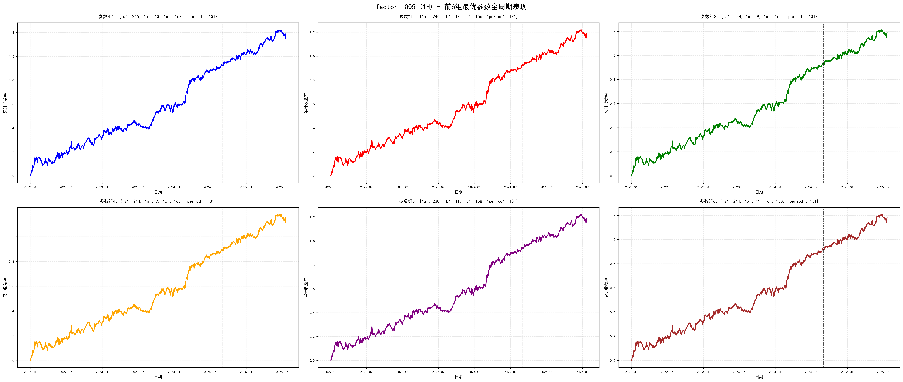
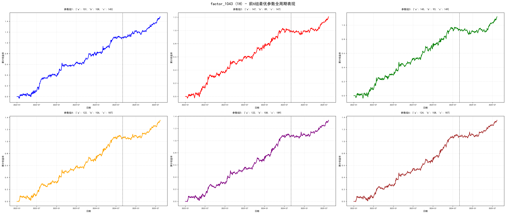
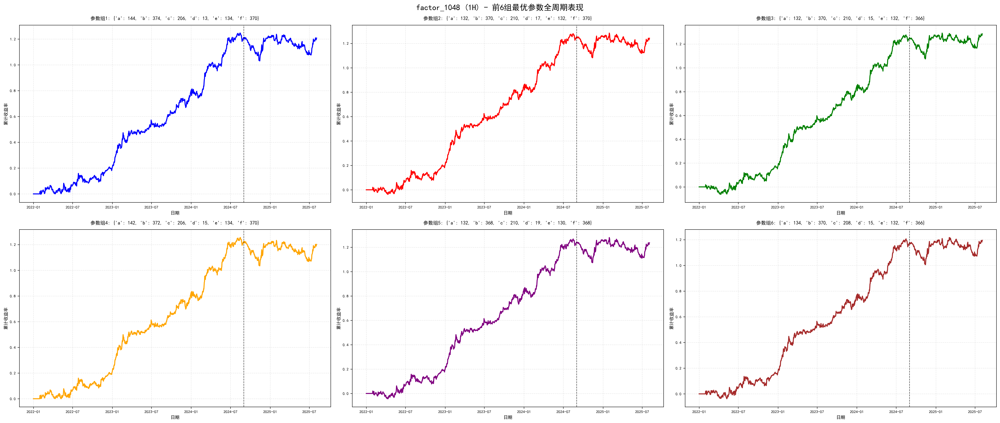
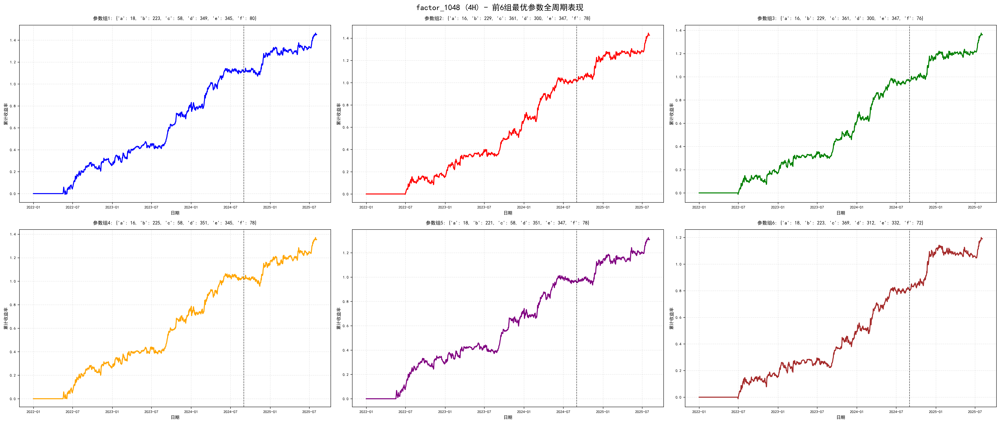
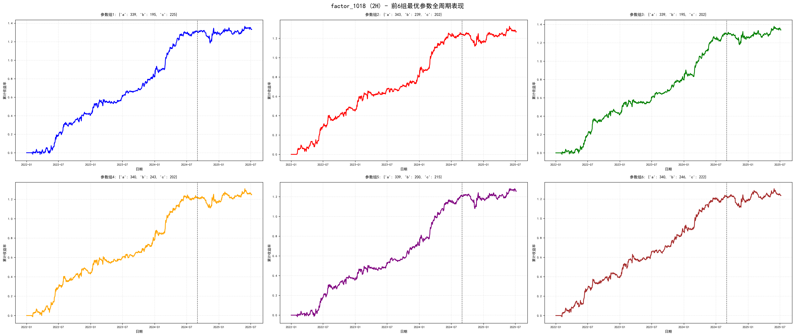
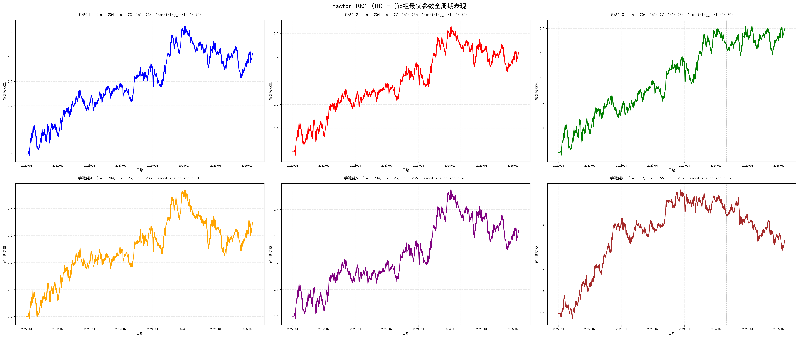

# Single-Factor Parameter Experiments

[English](research-cases.en.md) | [简体中文](research-cases.md)

[Project home](../README.md)

I selected six completed experiments, each showing six candidate parameter sets. Dashed lines in the charts mark the sample boundary; the curves show cumulative returns over the full backtest period. Metric definitions are in the [methodology](methodology.en.md).

IS = in-sample; OOS = out-of-sample. Annualized returns use arithmetic annualization, and drawdown is measured against fixed initial capital.

## 1. Performance across both periods: factor_1005 / 1H

The first parameter set has an annualized return of 34.5% in sample and 29.9% out of sample, with relatively similar results across the two periods. The other five sets are included for comparison.

[Full-size chart](../assets/factor-1005-1h.png) · [Parameters and performance report](../reports/factor-1005-1h.txt)

| Parameter set | IS annualized return | OOS annualized return | IS Sharpe | OOS Sharpe | IS max drawdown | OOS max drawdown |
|---|---:|---:|---:|---:|---:|---:|
| 1 | 34.5% | 29.9% | 2.118 | 2.127 | 7.8% | 7.2% |
| 2 | 34.5% | 30.3% | 2.107 | 2.153 | 7.9% | 7.0% |
| 3 | 34.7% | 29.4% | 2.114 | 2.093 | 8.0% | 6.5% |
| 4 | 33.3% | 30.1% | 2.031 | 2.157 | 7.8% | 6.4% |
| 5 | 35.3% | 28.0% | 2.141 | 2.013 | 8.2% | 7.0% |
| 6 | 34.4% | 29.5% | 2.103 | 2.104 | 8.1% | 6.6% |

## 2. Comparing candidate parameters: factor_1043 / 1H

The retained parameters still differ substantially out of sample: the first set has an annualized return of 40.6%, compared with 19.0% for the third. I include multiple sets to examine how performance depends on parameter selection.

[Full-size chart](../assets/factor-1043-1h.png) · [Parameters and performance report](../reports/factor-1043-1h.txt)

| Parameter set | IS annualized return | OOS annualized return | IS Sharpe | OOS Sharpe | IS max drawdown | OOS max drawdown |
|---|---:|---:|---:|---:|---:|---:|
| 1 | 41.2% | 40.6% | 2.270 | 2.825 | 7.0% | 7.6% |
| 2 | 37.1% | 22.9% | 2.171 | 1.774 | 6.8% | 6.3% |
| 3 | 35.1% | 19.0% | 2.030 | 1.465 | 7.2% | 8.6% |
| 4 | 39.6% | 31.0% | 2.359 | 2.437 | 8.0% | 6.4% |
| 5 | 40.1% | 28.0% | 2.365 | 2.093 | 8.2% | 7.3% |
| 6 | 40.4% | 28.9% | 2.403 | 2.237 | 8.4% | 8.2% |

## 3. One-hour version: factor_1048 / 1H

The first parameter set for the one-hour version has a high in-sample return but is close to break-even out of sample. The next experiment uses the four-hour version of the same factor.

[Full-size chart](../assets/factor-1048-1h.png) · [Parameters and performance report](../reports/factor-1048-1h.txt)

| Parameter set | IS annualized return | OOS annualized return | IS Sharpe | OOS Sharpe | IS max drawdown | OOS max drawdown |
|---|---:|---:|---:|---:|---:|---:|
| 1 | 45.3% | -0.2% | 2.413 | -0.011 | 7.5% | 18.2% |
| 2 | 46.9% | -0.9% | 2.525 | -0.047 | 8.1% | 17.3% |
| 3 | 46.8% | 3.9% | 2.511 | 0.199 | 8.1% | 17.8% |
| 4 | 45.8% | -2.1% | 2.440 | -0.108 | 8.0% | 19.0% |
| 5 | 46.5% | -0.4% | 2.508 | -0.019 | 8.1% | 17.1% |
| 6 | 43.9% | 2.4% | 2.353 | 0.124 | 7.8% | 17.4% |

## 4. Four-hour version: factor_1048 / 4H

The four-hour version performs better out of sample. Parameters and random seeds also differ, so the difference cannot be attributed entirely to the timeframe.

[Full-size chart](../assets/factor-1048-4h.png) · [Parameters and performance report](../reports/factor-1048-4h.txt)

| Parameter set | IS annualized return | OOS annualized return | IS Sharpe | OOS Sharpe | IS max drawdown | OOS max drawdown |
|---|---:|---:|---:|---:|---:|---:|
| 1 | 41.9% | 35.9% | 2.212 | 1.815 | 8.1% | 7.4% |
| 2 | 38.3% | 43.9% | 2.162 | 2.146 | 8.2% | 7.2% |
| 3 | 36.3% | 42.5% | 2.073 | 2.095 | 8.0% | 6.9% |
| 4 | 38.5% | 35.2% | 2.039 | 1.755 | 8.4% | 9.3% |
| 5 | 36.1% | 37.3% | 1.929 | 1.883 | 8.8% | 8.2% |
| 6 | 30.4% | 40.9% | 1.725 | 2.014 | 8.0% | 9.6% |

## 5. Weaker out-of-sample performance: factor_1018 / 2H

In-sample returns are high in this experiment, but all six parameter sets weaken substantially out of sample.

[Full-size chart](../assets/factor-1018-2h.png) · [Parameters and performance report](../reports/factor-1018-2h.txt)

| Parameter set | IS annualized return | OOS annualized return | IS Sharpe | OOS Sharpe | IS max drawdown | OOS max drawdown |
|---|---:|---:|---:|---:|---:|---:|
| 1 | 49.0% | 3.0% | 2.916 | 0.174 | 6.9% | 13.7% |
| 2 | 46.6% | 3.0% | 2.731 | 0.172 | 6.6% | 14.0% |
| 3 | 48.7% | 5.0% | 2.868 | 0.271 | 7.2% | 13.5% |
| 4 | 45.6% | 3.7% | 2.640 | 0.222 | 6.9% | 12.1% |
| 5 | 45.4% | 5.5% | 2.660 | 0.307 | 6.9% | 14.6% |
| 6 | 46.0% | 1.1% | 2.737 | 0.063 | 7.5% | 13.2% |

## 6. Out-of-sample losses: factor_1001 / 1H

The first parameter set falls from an annualized return of 16.4% in sample to -2.5% out of sample. Most of the other candidates also lose money out of sample.

[Full-size chart](../assets/factor-1001-1h.png) · [Parameters and performance report](../reports/factor-1001-1h.txt)

| Parameter set | IS annualized return | OOS annualized return | IS Sharpe | OOS Sharpe | IS max drawdown | OOS max drawdown |
|---|---:|---:|---:|---:|---:|---:|
| 1 | 16.4% | -2.5% | 0.965 | -0.166 | 10.1% | 15.2% |
| 2 | 16.7% | -3.2% | 0.934 | -0.206 | 10.6% | 13.6% |
| 3 | 15.9% | 7.6% | 0.920 | 0.515 | 10.8% | 11.5% |
| 4 | 13.8% | -2.7% | 0.784 | -0.170 | 10.4% | 16.5% |
| 5 | 14.3% | -6.9% | 0.795 | -0.442 | 11.0% | 16.5% |
| 6 | 16.7% | -12.6% | 0.999 | -0.795 | 11.6% | 24.0% |
